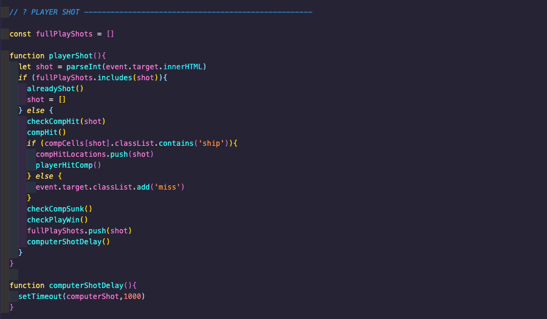
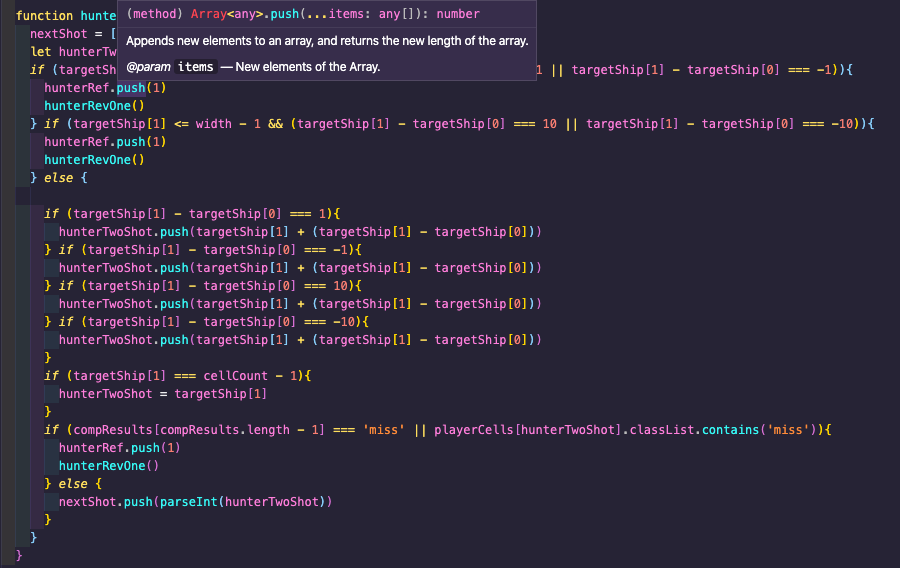
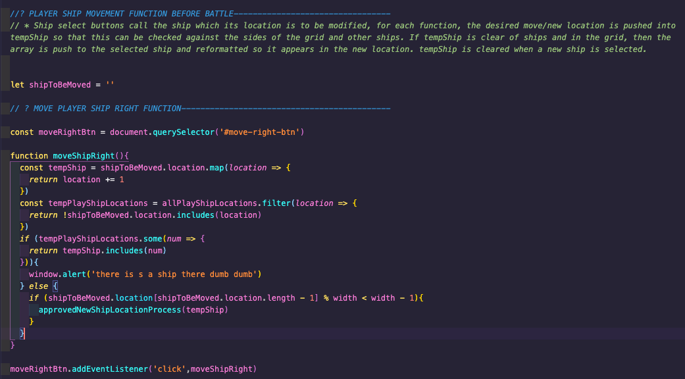

<!--  -->

# General Assembly Project 1: BattleShips

### Overview
I built this version of Battleships, branded PirateShips of the Caribbean, solo and in one week as my first project on General Assembly's Software Engineering Immersive course in one week. 

### Brief
- Build a browser based game using JavaScript
- The game must be grid based
- Use JavaScript and DOM manipulation
- Deploy the game online

### Timeframe
7 days

### Technologies used
- HTML5
- CSS
- JavaScript
- Github
- Github Pages
- Flexbox
- Google Fonts

### Deployment
This game has been deployed on GitHub Pages and can be found here: https://brobo01.github.io/sei-project-one/

Use the clone button to download the game source code. Open the index.html file in your browser and the game should start, if not check the console for any issues.

### The Build
I chose to build a battle ships game having played it extensively growing up and felt that creating the functionality where the computer hunts a ship based on where it has landed a hit presented a very interesting challenge.

To begin the build, I created the two grids of 10*10 for the player and computer maps. For me, a critical part of the MVP was that the computer's ships should be placed randomly on the grid. To effect this, I created a function which first decides whether the ship is horizontal or vertical, as this impacts on where the ships can be placed. I used the concept of a reference block (top cell for vertical and left of horiztonal) and then calculate where these can go on the grid. The final aspect to this function was to check whether any of the proposed cells were already occupied. If any cells were then the function runs again, iterating through the array of objects (each ship is an object) until all the ships are placed.

The next step was to build in the shooting functionality. This was effected by the user clicking on a cell, which fires a function with the cell name parsed in. This function checks whether the player has already shot there first, and then checks whether any of the computers ships are located in that cell and either includes the cell in a hits or misses array. The computer then takes a shot and runs a similar function. The below code shows the player shot function which fires when the user clicks on a square on the computers grid and shows how many separate functions and checks run off that single click.

Once the basic computer shot function had been established, I moved on to the hunter function. This set of functions means that when the computer hits a ship, the 4 surrounding cells are pushed into the nextShot array (the computer's shot is value [0] of the array, allowing a stacking of next shots). Where the next hit landed shows whether the target ship is horiztonal or vertical, and this influences where the next shots are taken. Once this worked, I built in functionality whereby if the previous shot was on the edge of the board, then the game would leave the hunter function and enter a hunter reverse function, which meant the shot track doubled back on itself and then the shots went the opposite way from the first shot. Finally, I added in the functionality so that if the computer's first hit was in the middle of the ship, then the hunter reverse function when trigger when the computer missed but the ship still wasn't sunk. Once this was complete, I could add in the taunts relating to the computer sinking the player's ship! 

The below code is the Hunter 2 function, which shows how once the computer has landed a second hit, then the function checks if the next logical square is on the board (and if not calls a separate function), followed by whether the ship is horizontal or vertical which influences the what cell is pushed into the nextShot array.

The final major code block was related to locating the players ships. Having considered the best way to achieve this from a UX perspective, I settled on the ships appearing on the board at the initialisation of the game in predetermined locations, and then the player can move them around the board using the points of a compass and a rotate button. To effect this, when the player clicks on a ship to move, it pushes the locations into an array which calculates whether the ship is horizontal or vertical. When the player clicks on a compass point, East for example, if the ship is horizontal then the function subtracts 1 from each value, and 10 if horizontal. These values are then checked to see if any ship occupies the proposed location and either moves the ship or fires a notification that there's a ship there already. Finally, to rotate the ship a similar function is used which calculates the ship's direction and what the cells would be if it we the opposite direction (based on the reference block), checks whether the cells are unoccupied and moves the ship.

The below code shows the function to move a ship to the right. 

Finally came styling... I chose a Pirates of the Caribbean theme because of the recognisable characters and plenty of stylistic options. While the application is only on a single page, I used hiding and showing divs to give the feeling of moving through a game whilst remaining on the same page. The styling also allowed me to include clear directions on how to play the game and also add a bit of humour to the taunts when playing.

### User experience
A landing page was added to provide the initial theming and instructions on how to play the game, which is hidden on the click of a button to show the start of the gameplay - the player locating their ships on their grid, which was created through DOM manipulation.

To locate their ships, the player can move them around the board using the points of a compass and a rotate button. This required heavy logic to ensure that the ships couldn't move either where there was another ship or off the edge of the board, especially for rotating.

The computer's ships are randomly located by first either choosing horizontal or vertical and then the squares to occupy. The location function is then repeated if there is a ship in any of the squares, with the function iterating through the remaining ship objects in the array until all the ships are located. 

Once the player has located their ships, the computer's board becomes visible and the player can start by taking a shot. When computer then takes a shot and when it hits a player ship, a hunter function is then used to determine the direction of the ship and then continue hitting it until it is sunk.

### Bugs
As I built the game using an MVP plus features format with extensive testing during the build phase of each feature, there are no known bugs with the exception that when first loaded on a new device, the game logic doesn't work as intended. This is corrected by reloading the page and is a bug which became apparent on deployment throught Github Pages. Once the page has been reloaded, the game functions as intended.

### Challenges and Wins
The challenges encountered during the build were related to the additional features and also represented the biggest wins of the project. The biggest of which was the hunter logic for the computer taking shots as, while visually fairly unimpressive (the logic simply follows what a person would do!) the logic to get the computer to fire the shots following a hit around that square and then continue hitting the ship was a major win, as it included scenarios for if the ship was at the edge of the board (and therefore the computer didn't need to shoot the square which was either on a different row or column) or if the ship was hit in the middle, it would need to follow all the way till it missed and then go back to the original shot and continue in that direction until the ship was sunk.

The more visually impressive challenge was allowing the player to move their ships around the board using the compass buttons, as this had to check whether the proposed new location was either beyond the end of the board of contained a part of a ship. 

### Key Learnings and Takeaways
The key learning from this project was the importance of planning out the build process and breaking it into smaller, manageable pieces of work. This was demonstrated in creating the hunter logic in particular, which as a complete set of functions has to accomplish a number of different goals, the result of which then influence how the function works. By breaking the hunter logic down in to its component parts, it was then possible to build up to a set of functions that not only push the next four shots into the nextShot array (based on where the hit had been made), but it also had to account for one of those shots being either off the edge of the board or being a square that had already been shot. Had I not planned out how to create this logic, it would've quickly become overwhelming to write! 

### Future Content
To continue the development of the game, I would include sound effects and animation for taking shots and add in further logic to the computer shooting to focus on areas where players tend to put their ships first before widening the field of fire to the rest of the board.