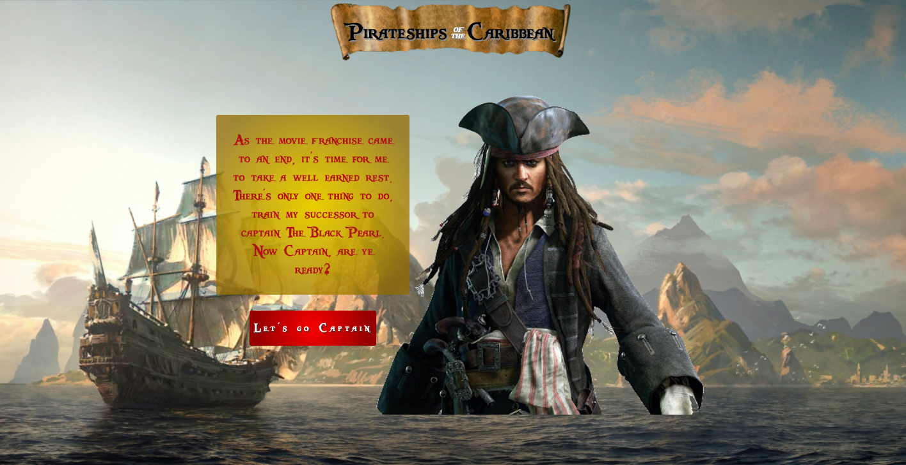
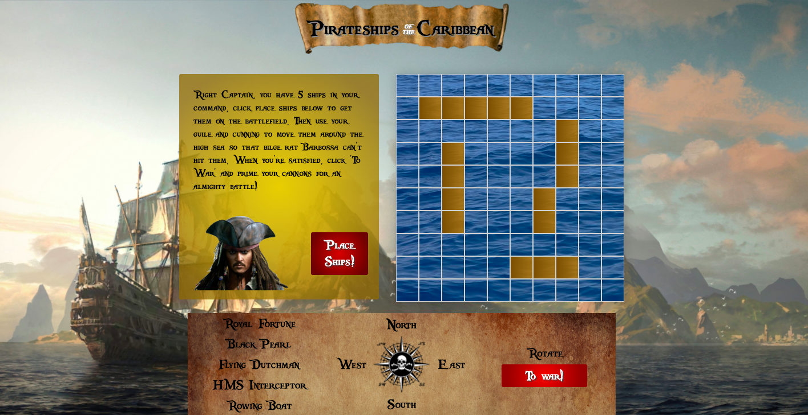
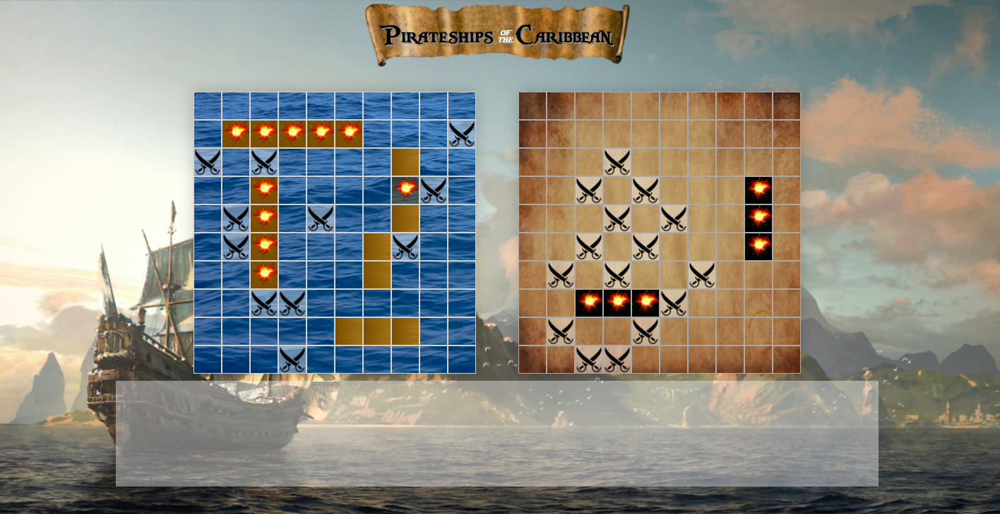

<!--  -->

# General Assembly Project 1: BattleShips

### Overview
I built this version of Battleships, branded PirateShips of the Caribbean, solo and in one week as my first project on General Assembly's Software Engineering Immersive course in one week. 

### Brief
- Build a browser based game using JavaScript
- The game must be grid based
- Use JavaScript and DOM manipulation
- Deploy the game online

### Timeframe
7 days

### Technologies used
- HTML5
- CSS
- JavaScript
- Github
- Github Pages
- Flexbox
- Google Fonts

### Deployment
This game has been deployed on GitHub Pages and can be found here: https://brobo01.github.io/sei-project-one/

Use the clone button to download the game source code. Open the index.html file in your browser and the game should start, if not check the console for any issues.

### User experience:

A landing page was added to provide the initial theming and instructions on how to play the game, which is hidden on the click of a button to show the start of the gameplay - the player locating their ships on their grid, which was created through DOM manipulation.

To locate their ships, the player can move them around the board using the points of a compass and a rotate button. This required heavy logic to ensure that the ships couldn't move either where there was another ship or off the edge of the board, especially for rotating.

The computer's ships are randomly located by first either choosing horizontal or vertical and then the squares to occupy. The location function is then repeated if there is a ship in any of the squares, with the function iterating through the remaining ship objects in the array until all the ships are located. 

Once the player has located their ships, the computer's board becomes visible and the player can start by taking a shot. When computer then takes a shot and when it hits a player ship, a hunter function is then used to determine the direction of the ship and then continue hitting it until it is sunk

### Bugs
As I built the game using an MVP plus features format with extensive testing during the build phase of each feature, there are no known bugs with the exception that when first loaded on a new device, the game logic doesn't work as intended. This is corrected by reloading the page and is a bug which became apparent on deployment throught Github Pages. Once the page has been reloaded, the game functions as intended.

### Challenges and Wins
The challenges encountered during the build were related to the additional features and also represented the biggest wins of the project. The biggest of which was the hunter logic for the computer taking shots as, while visually fairly unimpressive (the logic simply follows what a person would do!) the logic to get the computer to fire the shots following a hit around that square and then continue hitting the ship was a major win, as it included scenarios for if the ship was at the edge of the board (and therefore the computer didn't need to shoot the square which was either on a different row or column) or if the ship was hit in the middle, it would need to follow all the way till it missed and then go back to the original shot and continue in that direction until the ship was sunk.

The more visually impressive challenge was allowing the player to move their ships around the board using the compass buttons, as this had to check whether the proposed new location was either beyond the end of the board of contained a part of a ship. 

### Future Content
To continue the development of the game, I would include sound effects and animation for taking shots and add in further logic to the computer shooting to focus on areas where players tend to put their ships first before widening the field of fire to the rest of the board.